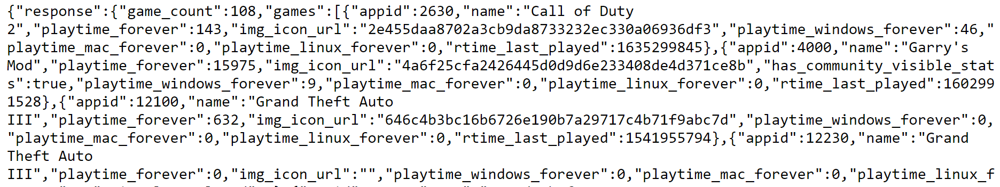
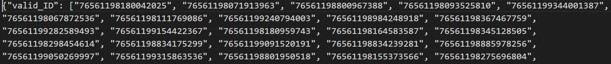
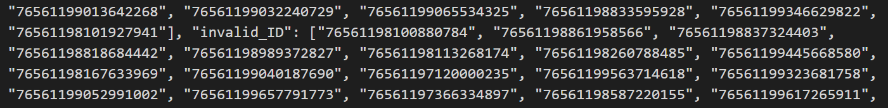
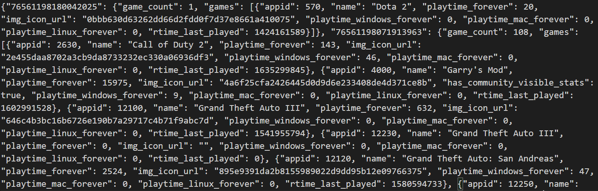
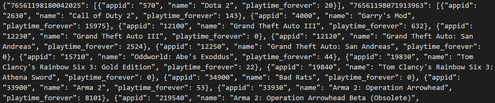
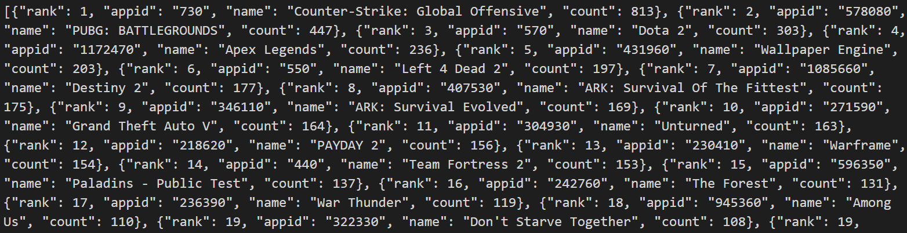
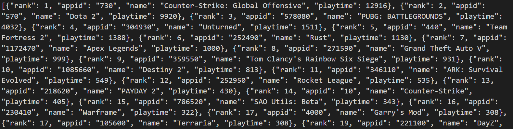
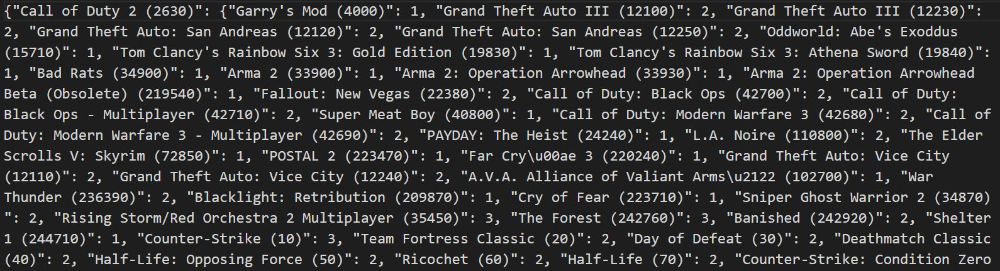
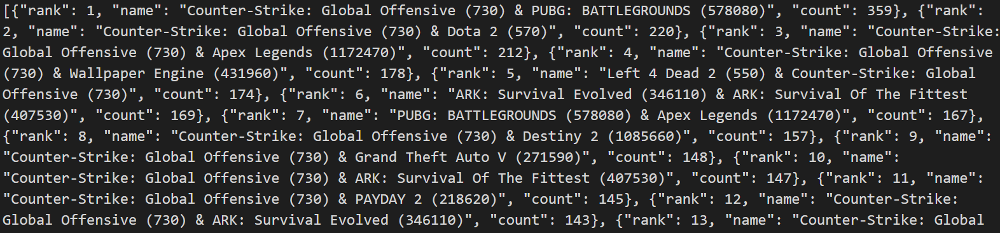
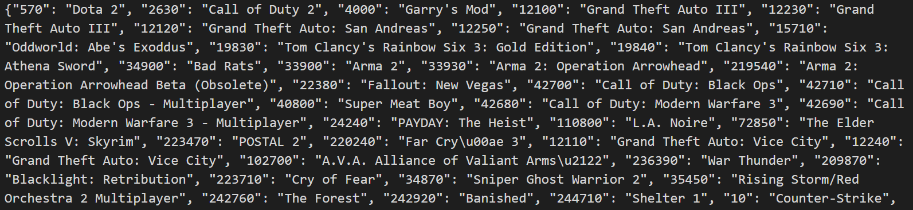

# SI_507_final_project: Apichaph
# Project code: Special instructions

## How to supply API keys: 
I got the Steam API from https://steamcommunity.com/dev/apikey. There is a condition that the Steam account must spend more than 5.00 USD in the Steam Store to be able to get the API key.

## How to interact with the program:
I choose Flask to present the output. The python file to run the Flask is **'Apichaph_06_Flask'**. All the templates is stored in template folder. To run the webpage, simply open a terminal and navigate to the location where the file is stored.
Then, type *python Apichaph_06_Flask.py* in the terminal to allow running the webpage. Finally, access the homepage by going to http://127.0.0.1:5000/

There are 2 ways to interact with the project. The first way is choosing the type of rank that web-user want to see. There are 3 types of rank 

    1) rank by the number of Steam users (in this sample) owning the games 
    2) rank by the total amount of time Steam users (in this sample) have spent on the games and 
    3) rank by the number of Steam users (in this sample) owning the game combination e.g. how many users own the sim 3 and 4 together

The second way is to submit an input and the program will return a related output. There are 3 interaction panels. 
    
    1) submit a game ID and get a game name as an output or submit a game name and get a game ID as an output. This will help web-users to check that their favorite games are included in this project or not.
    2) submit a game ID and get 50 latest news of that game as an output.
    3) submit a game ID or game name to see the related ranks of that game, or submit a rank to see what games are on that rank.

## Python packages requirement: 1) requests 2) Flask 3) datetime

# Data Structure 
- There are 3 main goals of this project.

1. rank the games base on the number of Steam users who own the game

2. rank the games base on total amount of time Steam users have dedicated to the game

3. rank the game combination based on the number of Steam users who own the game combination

**Apichaph_01_retrieve_API**
- First, I randomly generated Steam user ID and tried to retrieve Steam user data. If the user ID exists and set as public (valid ID), the return structure is

    {"response": {"game_count": integer, "games": [{"appid":integer, "playtime_forever":integer, "name":str,.....},.....]}}

    If the user ID does not exist or set as private (invalid ID), the return structure is {}

    
Screen shot of example response

response_example
- Then, I stored Steam ID that I already made a call in json file called __"SteamID_cache"__. If the ID is valid, it is stored in "valid_ID" key. If the ID is invalid, it is stored in "invalid_ID" key. This allows me to check whether I have already retrieved data for that particular ID and help to avoid redundant API calls. Also, since I can make a 100,000 call per day, I can learn the pattern of valid and invalid ID, and change a Steam ID random generate function to increase the chance of getting a valid ID.
    
Screen shot from "SteamID_cache"

 

- For the record that I retrieved, I stored in json file called __"Game_owned_cache"__. I used Steam ID as a key and stored the number of game that this ID own and all the game that this ID own as a value. (The structure is shown below)

    {unique SteamID which is a str:
        {"game_count": integer,
         "games": [{"appid": int, "name": str, "playtime_forever": int, ...}, ...]}, 
         ...}

Screen shot from "Game_owned_cache"

 

**Apichaph_02_clean_data**
- The next step is cleaning data. I deleted the user with 0 games and choose to store appid, name, playtime_forever for each game in each Steam ID. I stored this clean data in __"Cleaned_data_cache"__

    {unique SteamID which is a str:
    {"game_count": integer,
    "games": [{"appid": int, "name": str, "playtime_forever": int, ...}, ...]}, 
    ...}

 

Screen shot from "Cleaned_data_cache"

 

**Apichaph_03_game_ranking**
- This part is to achieve goal 1 and 2. I started with counting how many user own this game and then rank it. I did the same way to count how long people spent time on this game and then rank it. The final structure are [{"rank": int, "appid": str, "name": str, "count": int}, ...] and [{"rank": int, "appid": str, "name": str, "playtime": int}, ...]. I stored each list separately in json files. The one containing count (goal 1) is stored in __"ranking_owned_game"__ and another one containing playtime (goal 2) is stored in __"ranking_duration_game"__

 

Screen shot from "ranking_owned_game"

 

Screen shot from "ranking_duration_game"

**Apichaph_04_game_graph**
- This part is to achieve goal 3. I made an undirected graph by connecting every game a single user ID own and I repeated it for every Steam user in my sample. For example, if the first person own game 'A', 'B', and 'C', I created the link of A&B, A&C, and B&C. Note that A&B are the same as B&A.

- An example structure of this graph is {'A': vertex_object_A, 'B': vertex_object_B, 'C': vertex_object_C}.
    Meanwhile, vertex object A has an attribute (connectedTo) to store the neighbors and weight. For example, vertex_object_A.connectedTo will return {'B':1, 'C':1}. If the next person own game 'A' and 'B', vertex_object_A.connectedTo will return {'B:2, 'C':1} and vertex_object_B.connectedTo will return {'A':2, 'C':1}

- The presentation of the graph is stored in json file called __"Steam_graph_to_store"__. The structure of this data is 

    {game name which is a str : {another game name : weight which is an int, another game name : weight,...},...}

Screen shot from "Steam_graph_to_store"

- In order to read __"Steam_graph_to_store.json"__, use file __"Steam_graph_to_store.py"__ to read it. This file will convert json file into a graph object.

- After I made a graph and finished connecting games of each user, I needed to rank it base on how many people own the combination. First, I needed to convert the graph into an appropriate structure because there are redundant data in the graph. For example, as I mention above, vertex_object_A shows that it connects to 'B' with weight 2 and vertex_object_B shows that it connects to 'A' with weight 2.

- I made a new key from games e.g. __'A' & 'B'__ and store its weight as a value in a new dictionary. Then, when I met __'B' & 'A'__, I can ignore this combination (because I already keep it in a new dictionary) and move on to the next combination. Then, I rank the combination base on the weight (how many users own this combination). The data is stored in json file called __"ranking_combination"__

- The structure of this file is [{"rank":int, "name":str, "count":int},.....]

 

Screen shot from "ranking_combination"

**Apichaph_05_game_id_name**
- This process used cache from the second step, __"Cleaned_data_cache"__. I extract game ID and game name and stored it in json file called __"game_id_name"__. This will help checking whether the game in in the project or not, and help retrieve news from Steam API.

 

Screen shot from "game_id_name"

 
**Apichaph_06_Flask**
- Flask part, creating a webpage to present data with web-user.

